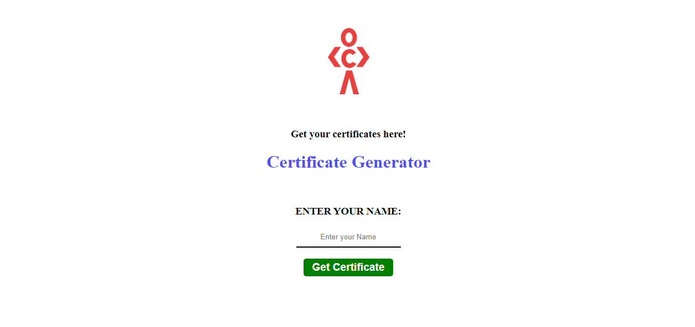

# Certificate Generator

### Certificate Sample 

There is only one route in this project. On entering your name in the input box and clicking on `Generate Certificate`, the certificate with the name should be downloaded in the pdf format. 

Most of the work for this project is done using the library `PDFlib` and `FileSaver.js`.

Steps: 
1. Fetch the certificate from file system 
2. load the document using the `PDFDocument` object
3. load the font by fetching from file system
4. Embed the font resource in the pdf object
5. insert the test from the input box at the empty area where the name goes (with x,y and font-size)
6. save the file 
7. create a new file object in JavaSScript and download it using the `saveAs(fileName)` 

You can refer to  [PDF-LIB documentation](https://pdf-lib.js.org/) to find out about the methods. 

## Send feedback!

I love receiving feedback! I am always looking to improve my projects. So if you have anything you'd like to mention, please visit add a pull request with comments.

### Disclaimer

I made this project in 1 day for the Codedamn HacktoberFest Challenge, which can be found on the [Codedamn's GitHub](https://github.com/codedamn/projects). 